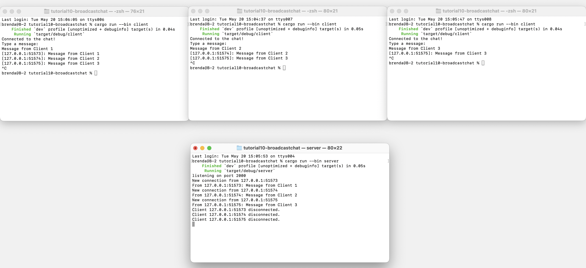

# Modul 10 Pemrograman Lanjut : Asynchronous Programming
oleh **Brenda Po Lok Fahida**

 
 

## Experiment 2.1: Original code, and how it run

 

Setelah menjalankan satu server dan tiga client, hasil yang ditampilkan menunjukkan bahwa server berhasil menerima koneksi dari setiap client yang terhubung melalui alamat 127.0.0.1 dengan port yang berbeda. Masing-masing client menampilkan pesan "Connected to the chat!" sebagai tanda bahwa koneksi ke server berhasil.

Pertama, Client 1 dijalankan dan mengirimkan pesan "Message from Client 1". Karena pada saat itu hanya Client 1 yang terhubung, maka pesan ini belum diterima oleh client lain. Setelah itu, Client 2 dijalankan dan kemudian mengirimkan pesan "Message from Client 2", yang diterima oleh Client 1 karena masih aktif dan terhubung. Proses ini dilanjutkan dengan koneksi dari Client 3, lalu mengirimkan pesannya sendiri "Message from Client 3", yang diterima oleh kedua client sebelumnya. Hal ini menunjukkan bahwa hanya client yang masih aktif dan sudah terhubung saat pesan dikirim yang akan menerima pesan tersebut. Server juga mencatat setiap koneksi dan pemutusan koneksi (disconnect) dari client secara real-time, serta mencetak log dari setiap pesan yang diterima. 
