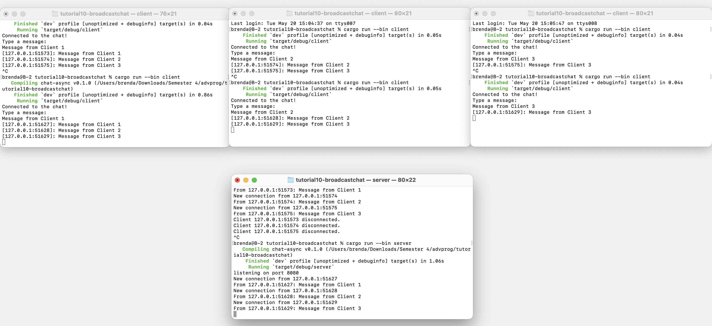

# Modul 10 Pemrograman Lanjut : Asynchronous Programming
oleh **Brenda Po Lok Fahida**

<br>
<br>


## Experiment 2.1: Original code, and how it run


<br>


Setelah menjalankan satu server dan tiga client, hasil yang ditampilkan menunjukkan bahwa server berhasil menerima koneksi dari setiap client yang terhubung melalui alamat 127.0.0.1 dengan port yang berbeda. Masing-masing client menampilkan pesan "Connected to the chat!" sebagai tanda bahwa koneksi ke server berhasil.

Pertama, Client 1 dijalankan dan mengirimkan pesan "Message from Client 1". Karena pada saat itu hanya Client 1 yang terhubung, maka pesan ini belum diterima oleh client lain. Setelah itu, Client 2 dijalankan dan kemudian mengirimkan pesan "Message from Client 2", yang diterima oleh Client 1 karena masih aktif dan terhubung. Proses ini dilanjutkan dengan koneksi dari Client 3, lalu mengirimkan pesannya sendiri "Message from Client 3", yang diterima oleh kedua client sebelumnya. Hal ini menunjukkan bahwa hanya client yang masih aktif dan sudah terhubung saat pesan dikirim yang akan menerima pesan tersebut. Server juga mencatat setiap koneksi dan pemutusan koneksi (disconnect) dari client secara real-time, serta mencetak log dari setiap pesan yang diterima. 


## Experiment 2.2: Modifying port


<br>

Setelah port pada server dan client diubah dari 2000 menjadi 8080, aplikasi tetap berjalan dengan baik dan tidak menunjukkan adanya error saat koneksi dilakukan. Perubahan dilakukan pada dua file, yaitu `server.rs` dan `client.rs`, yang masing-masing menggunakan alamat `127.0.0.1` dengan port yang telah disesuaikan. Server menggunakan `TcpListener::bind("127.0.0.1:8080")` untuk membuka koneksi, sedangkan client terhubung menggunakan URI WebSocket `ws://127.0.0.1:8080`. Hal ini menunjukkan bahwa baik server maupun client menggunakan protokol WebSocket yang sama dan didefinisikan melalui crate `tokio_websockets`, dengan `ServerBuilder` pada sisi server dan `ClientBuilder` pada sisi client. Setelah pengujian dengan tiga client yang masing-masing mengirim pesan, server berhasil menampilkan dan meneruskan setiap pesan ke semua client yang sedang terhubung. Ini membuktikan bahwa perubahan port tidak mempengaruhi fungsionalitas aplikasi.


## Experiment 2.3: Small changes, add IP and Port


<br>

Untuk memberikan identitas sementara pada setiap endpoint, saya melakukan dua modifikasi pada kode server dan satu modifikasi pada kode client:

1. **Server**

   * Mengganti log default saat koneksi baru diterima agar menyertakan label *"Brenda's Computer"*. Diubah dari:

     ```rust
     println!("New connection from {addr:?}");
     ```

     menjadi:

     ```rust
     println!("New connection from Brenda's Computer {addr:?}");
     ```

     Hal ini memudahkan kita membedakan log lokal dengan informasi pengirim.

   * Mengubah format log untuk setiap pesan yang diterima agar mencetak alamat pengirim sebagai *"From client {addr}"* dan memasukkan IP\:Port ke dalam pesan broadcast:

     ```rust
     println!("From client {addr}: {text}");
     let formatted = format!("[{addr}]: {text}");
     ```

     Perubahan ini membuat konsol server dan client lebih jelas dalam menunjukkan siapa pengirim tiap pesan.

2. **Client**

   * Menambahkan prefix *"Brenda's Computer - From server:"* sebelum menampilkan pesan dari server:

     ```rust
     println!("Brenda's Computer - From server: {text}");
     ```

     Tujuannya agar kita tahu bahwa log tersebut berasal dari server, bukan dari input lokal.

### Contoh Hasil Output

```
listening on port 8080
enew connection from Brenda's Computer 127.0.0.1:51663
From client 127.0.0.1:51663: Message from Client 1
From client 127.0.0.1:51665: Message from Client 2
...
```

```
Connected to the chat!
Brenda's Computer - From server: [127.0.0.1:51663]: Message from Client 1
Brenda's Computer - From server: [127.0.0.1:51665]: Message from Client 2
```

Dengan perubahan ini, log pada server dan client menjadi lebih informatif mengenai sumber dan tujuan pesan, sehingga memudahkan debugging dan pemantauan aktivitas chat.

